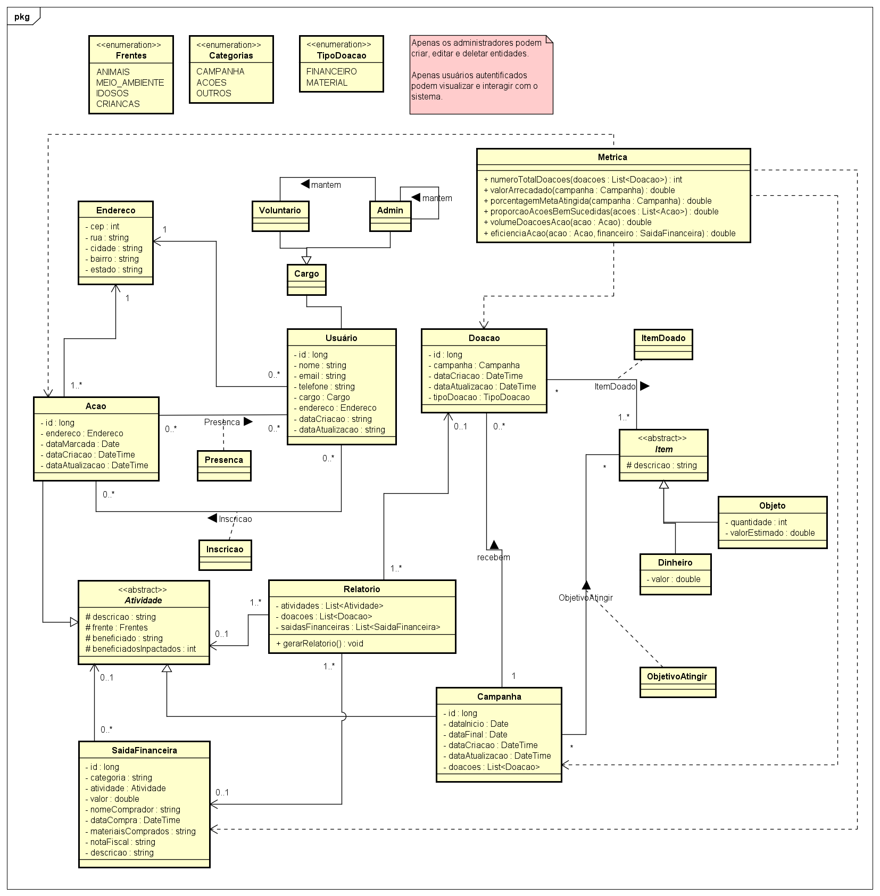
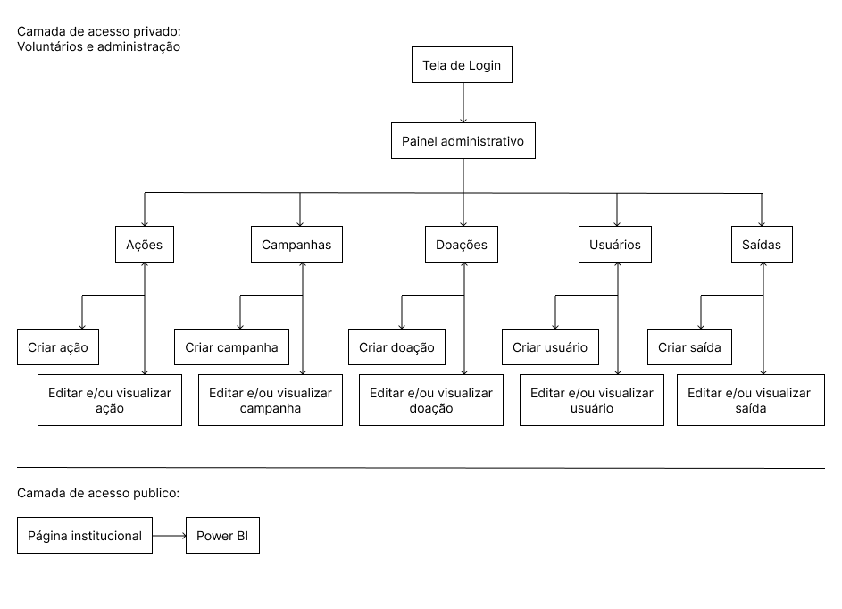
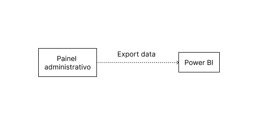

# Diagrama de classes (UML)

O diagrama UML mostra como foi pensado o modelo do sistema a partir das informações recebidas pela ONG. Como eles não tem um sistema, foi preciso modelar um do zero que supra as necessidades da organização.

# Diagrama de Banco de Dados

O diagrama do banco de dados mostra as tabelas que terão os dados persistidos no banco do sistema.

# Fluxo do Sistema

O sistema proposto conta com duas camadas, uma camada com a parte do acesso privado, que somente os administradores e voluntários possam visualizar, precisando se autenticar a partir da tela de login. E a outra camada de acesso público que conta com o acesso a página institucional da ONG, nessa página é possível fazer o acesso ao painel de dados da aplicação.

Na imagem a seguir é possível ter a visualização de como o BI se conecta ao painel, através dessa Job com o nome “Export Data” que ficará responsabilizado de passar os dados cadastrados no painel para a visualização do BI

